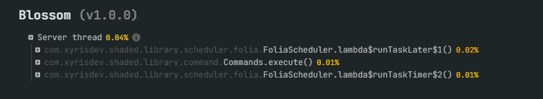
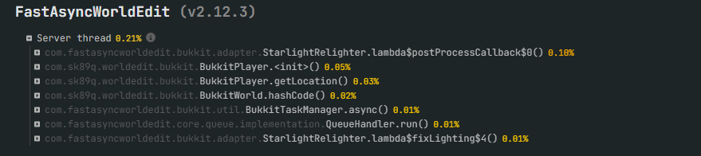

# Blossom

Blossom is a powerful plugin designed to regenerate arenas and regions (large collections of blocks) at blazing speeds with minimal impact on server performance. It is modern, lightweight, and easy to use, featuring a menu-based interface. Blossom utilizes FastAsyncWorldEdit for efficient arena regeneration.

***

### Usage
Creating and managing arenas with Blossom is so easy that even a newbie can do it! Just run `/blossom menu`, and you'll see for yourself. *Wink.*

### Statistics
We've extensively tested regenerating 1 million blocks repeatedly, and the performance impact was minimal. The regeneration time ranged between 150-500ms, even on a local server.

**Tested on:**
- **CPU:** 11th Gen Intel® Core™ i5-1155G7 @ 2.50GHz
*Tested on my localhost actually*

*These are the statistics from regenerating 1 million blocks continuously over five tests.*

### Support
Need help? Join our Discord server: [xyrisdev.com/discord](https://xyrisdev.com/discord/)

***

